  <b>Yusen Xie</b> — whole-body RL + LLM agent kernels for legged robots
   
  AI Engineering @ Carnegie Mellon University (prev. USYD) &nbsp;-&nbsp; Co-founder, Vector Robotics

<!-- Hand-written robotics HUD banner (assets/hud-banner.svg): lidar sweep, -->
<!-- quadruped trot (diagonal pairs in antiphase), NL->decompose->plan->control -->
<!-- pipeline, joint-state ticker, scanlines. Inline SMIL/CSS, system fonts only, -->
<!-- self-contained dark panel — camo-safe and legible on GitHub dark and light. -->
<!-- Non-clickable by design; the portfolio link lives on the robot GIF and the -->
<!-- badge row below. width=100% so it never overflows GitHub's content column. -->

  

  
  
  

  

### `[ selected_work ]`

> Physical-robot RL and control first; the tooling that makes it shippable second.

| Project | What it is |
|---|---|
| **[vector-os-nano](https://github.com/VectorRobotics/vector-os-nano)** | Cross-embodiment robot OS. Natural-language control with no fine-tuning, ROS2 Nav2 autonomy, and an MCP server that exposes every robot skill plus live world state to Claude Code. Runs on Unitree Go2 and SO-ARM101. |
| **[G1-locomotion-manipulation](https://github.com/yusenthebot/G1-end-to-end-locomotion-manipulation)** | Unitree G1 humanoid in Isaac Lab: two-phase decoupled-reward PPO (locomotion, then manipulation) across 2048 parallel envs. Success is gated on physical end-effector contact, not proximity; converges in ~2k iterations. |
| **[vector-graph](https://github.com/yusenthebot/vector-graph)** | Live code knowledge graph for ROS2, rendered in-browser as a Three.js 3D force-graph nebula. Pure-`ast` call/impact analysis exposing 17 MCP tools so agents check risk before they edit. 824 tests, 86% coverage. |
| **[openclaw-dashboard](https://github.com/yusenthebot/openclaw-dashboard)** | Builds on [mudrii/openclaw-dashboard](https://github.com/mudrii/openclaw-dashboard) — extended well past upstream with SSE-streamed live agent logs, billing-aware cost telemetry, and a terminal-aesthetic SPA for a local agent runtime (Python + Go). |

  <code>PyTorch - MuJoCo - Isaac Lab - ROS2 Jazzy - Nav2 - LiDAR / SLAM - MCP - Python - C++ - TypeScript - Docker</code>

---

<!-- 3D contribution graph - generated daily by .github/workflows/profile-3d.yml, -->
<!-- committed under profile-3d-contrib/ by the Action. Themed placeholder SVGs -->
<!-- are committed at the same paths so this section never renders a broken image -->
<!-- before the first run; the Action overwrites them with the real graphs. -->
<!-- Fallback  uses the night variant deliberately: its dark panel is -->
<!-- self-contained and legible on both GitHub themes. -->

  <picture>
    <source media="(prefers-color-scheme: dark)" srcset="./profile-3d-contrib/profile-night-rainbow.svg" />
    <source media="(prefers-color-scheme: light)" srcset="./profile-3d-contrib/profile-green.svg" />
    
  </picture>
   
  <code>[ contribution telemetry - regenerated daily by a GitHub Action ]</code>

  <code>[ contact ]</code> &nbsp;<a href="mailto:yusenthebot@outlook.com">yusenthebot@outlook.com</a>

