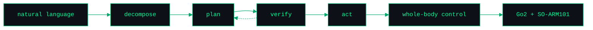

<!-- ASCII name banner: all lines padded to exactly 67 chars (incl. trailing -->
<!-- spaces) so per-line centering inside <pre> can never misalign the box art. -->

<pre>
██╗   ██╗██╗   ██╗███████╗███████╗███╗   ██╗    ██╗  ██╗██╗███████╗
╚██╗ ██╔╝██║   ██║██╔════╝██╔════╝████╗  ██║    ╚██╗██╔╝██║██╔════╝
 ╚████╔╝ ██║   ██║███████╗█████╗  ██╔██╗ ██║     ╚███╔╝ ██║█████╗  
  ╚██╔╝  ██║   ██║╚════██║██╔══╝  ██║╚██╗██║     ██╔██╗ ██║██╔══╝  
   ██║   ╚██████╔╝███████║███████╗██║ ╚████║    ██╔╝ ██╗██║███████╗
   ╚═╝    ╚═════╝ ╚══════╝╚══════╝╚═╝  ╚═══╝    ╚═╝  ╚═╝╚═╝╚══════╝
                                                                   
        WHOLE-BODY RL + LLM AGENT KERNELS FOR LEGGED ROBOTS        
        AI ENGINEERING @ CMU // CO-FOUNDER @ VECTOR ROBOTICS       
</pre>

<!-- Animated tagline: readme-typing-svg (demolab instance, verified live). -->
<!-- <picture> serves a darker green on light theme so it stays readable. -->

  <picture>
    <source media="(prefers-color-scheme: dark)" srcset="https://readme-typing-svg.demolab.com?font=Fira+Code&weight=500&size=16&pause=1200&duration=2600&color=00FF9C&center=true&vCenter=true&width=620&height=40&lines=%24+vector+%22fetch+the+bottle%22;decompose+-%3E+plan+-%3E+verify+-%3E+act;whole-body+RL+for+legged+robots;LLM+agent+kernel+--+no+fine-tuning;Unitree+Go2+%2B+SO-ARM101+--+sim2real" />
    <source media="(prefers-color-scheme: light)" srcset="https://readme-typing-svg.demolab.com?font=Fira+Code&weight=500&size=16&pause=1200&duration=2600&color=00935A&center=true&vCenter=true&width=620&height=40&lines=%24+vector+%22fetch+the+bottle%22;decompose+-%3E+plan+-%3E+verify+-%3E+act;whole-body+RL+for+legged+robots;LLM+agent+kernel+--+no+fine-tuning;Unitree+Go2+%2B+SO-ARM101+--+sim2real" />
    
  </picture>

  
  
  

  
   
  <code>now building -> vector-os-nano: one natural-language command in, whole-body motion out</code>

### `[ flagship ]`

<!-- Repo pin card: github-readme-stats (verified 200), self-contained dark -->
<!-- panel so it reads on both GitHub themes. -->

  
   
  Cross-embodiment robot OS — natural-language control with no fine-tuning, ROS2 Nav2 autonomy, and an MCP server exposing every robot skill plus live world state. Runs on Unitree Go2 and SO-ARM101.

<!-- The kernel loop. Mermaid renders natively on GitHub; theme:base with -->
<!-- self-contained dark node fills stays legible on light and dark pages. -->

  <code>[ the agent kernel loop — every command runs through it ]</code>

### `[ selected_work ]`

> Physical-robot RL and control first; the tooling that makes it shippable second.

| repo | signal |
|------|--------|
| [`G1Pilot`](https://github.com/VectorRobotics/G1Pilot) | C++ inverse kinematics for the Unitree G1 humanoid — Pinocchio + CasADi |
| [`vector_perception`](https://github.com/VectorRobotics/vector_perception) | full perception pipeline for general robotics |
| [`Hop-Dynamics`](https://github.com/yusenthebot/Hop-Dynamics) | wheeled bipedal robot with an active tail |
| [`openclaw-dashboard`](https://github.com/yusenthebot/openclaw-dashboard) | terminal-aesthetic agent control panel |

### `[ stack ]`

<pre>
$ vector skills --tree
.
├── learning/     RL (PPO) · imitation · diffusion policy · VLA/VLN · sim2real
├── control/      whole-body control · legged locomotion · IK · behavior trees · Nav2
├── perception/   SLAM · LiDAR-IMU odometry · sensor fusion · YOLO
├── simulation/   MuJoCo · Isaac Lab/Sim · Genesis · Gazebo
└── agents/       LLM agent kernels · MCP servers · tool calling · Claude Code
</pre>

  

---

<!-- 3D contribution graph - generated daily by .github/workflows/profile-3d.yml, -->
<!-- committed under profile-3d-contrib/ by the Action. Themed placeholder SVGs -->
<!-- are committed at the same paths so this section never renders a broken image -->
<!-- before the first run; the Action overwrites them with the real graphs. -->
<!-- Fallback  uses the night variant deliberately: its dark panel is -->
<!-- self-contained and legible on both GitHub themes. -->

  <picture>
    <source media="(prefers-color-scheme: dark)" srcset="./profile-3d-contrib/profile-night-rainbow.svg" />
    <source media="(prefers-color-scheme: light)" srcset="./profile-3d-contrib/profile-green.svg" />
    
  </picture>
   
  <code>[ contribution telemetry - regenerated daily by a GitHub Action ]</code>

  <code>[ contact ]</code> &nbsp;<a href="mailto:yusenthebot@outlook.com">yusenthebot@outlook.com</a>

