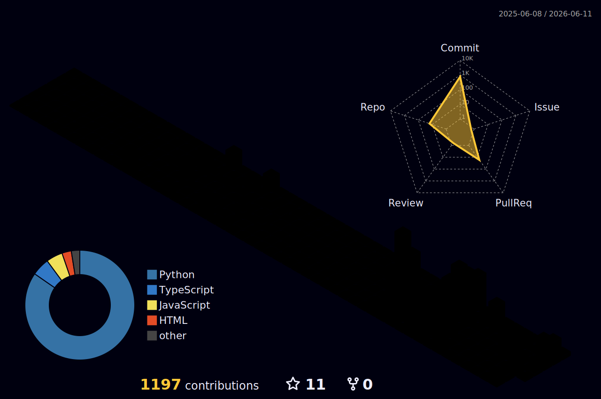

<!-- ASCII name banner: all lines padded to exactly 67 chars (incl. trailing -->
<!-- spaces) so per-line centering inside <pre> can never misalign the box art. -->

<pre>
██╗   ██╗██╗   ██╗███████╗███████╗███╗   ██╗    ██╗  ██╗██╗███████╗
╚██╗ ██╔╝██║   ██║██╔════╝██╔════╝████╗  ██║    ╚██╗██╔╝██║██╔════╝
 ╚████╔╝ ██║   ██║███████╗█████╗  ██╔██╗ ██║     ╚███╔╝ ██║█████╗  
  ╚██╔╝  ██║   ██║╚════██║██╔══╝  ██║╚██╗██║     ██╔██╗ ██║██╔══╝  
   ██║   ╚██████╔╝███████║███████╗██║ ╚████║    ██╔╝ ██╗██║███████╗
   ╚═╝    ╚═════╝ ╚══════╝╚══════╝╚═╝  ╚═══╝    ╚═╝  ╚═╝╚═╝╚══════╝
                                                                   
        WHOLE-BODY RL + LLM AGENT KERNELS FOR LEGGED ROBOTS        
        AI ENGINEERING @ CMU // CO-FOUNDER @ VECTOR ROBOTICS       
</pre>

<!-- Rotating tagline: readme-typing-svg in monochrome. White type for the dark -->
<!-- theme, near-black for the light theme, served via prefers-color-scheme. -->

  <picture>
    <source media="(prefers-color-scheme: dark)" srcset="https://readme-typing-svg.demolab.com?font=Fira+Code&weight=500&size=17&pause=1200&duration=2800&color=FFFFFF&center=true&vCenter=true&width=520&height=44&lines=Whole-body+RL+for+legged+robots;LLM+agent+kernels+%E2%80%94+no+fine-tuning;Sim2real+on+Unitree+Go2+%2B+SO-ARM101" />
    <source media="(prefers-color-scheme: light)" srcset="https://readme-typing-svg.demolab.com?font=Fira+Code&weight=500&size=17&pause=1200&duration=2800&color=24292F&center=true&vCenter=true&width=520&height=44&lines=Whole-body+RL+for+legged+robots;LLM+agent+kernels+%E2%80%94+no+fine-tuning;Sim2real+on+Unitree+Go2+%2B+SO-ARM101" />
    
  </picture>

<!-- Links: self-contained near-black chips (0d1117) with white text and white -->
<!-- logos, legible on both GitHub themes. The LinkedIn glyph is inlined as a -->
<!-- base64 data URI (simple-icons removed the LinkedIn brand); its fill is -->
<!-- baked white to match the monochrome chip set. -->

  
  
  
  

<!-- Owner-made pixel robot, doubling as the door to the portfolio site. -->

  
   
  <i>now building vector-os-nano: one natural-language command in, whole-body motion out</i>

 

<!-- Flagship: github-readme-stats pin card restyled as a black-and-white panel -->
<!-- (dark bg, white title and icons, gray body). Self-contained, so it reads -->
<!-- on both GitHub themes. The language dot keeps its color by design. -->

  
   
  Cross-embodiment robot OS: natural-language control with no fine-tuning, ROS2 Nav2 autonomy, and an MCP server exposing every robot skill plus live world state. Runs on Unitree Go2 and SO-ARM101.

 

<!-- Stack: skillicons.dev was dropped (its icons are inherently colorful with -->
<!-- no monochrome mode); a plain <pre> skills tree keeps the section black and -->
<!-- white and theme-adaptive. All lines padded to exactly 49 chars (incl. -->
<!-- trailing spaces) so per-line centering inside <pre> can never misalign it. -->

<pre>
$ vector skills --tree                           
.                                                
├── learning/     whole-body RL · sim2real       
├── control/      legged locomotion · ROS2 Nav2  
├── simulation/   MuJoCo · Isaac Lab             
├── agents/       LLM agent kernels · MCP servers
└── hardware/     Unitree Go2 · SO-ARM101        
</pre>

 

<!-- Commit-activity line graph: github-readme-activity-graph as a monochrome -->
<!-- telemetry panel - white trace and points on the same near-black bg as the -->
<!-- other cards, gray axis text, self-contained on both GitHub themes. -->

  
   
  commit activity, last 31 days

 

<!-- Contribution snake: generated by .github/workflows/snake.yml into the -->
<!-- output branch. These URLs 404 until the first workflow run; trigger -->
<!-- snake.yml once after pushing and they resolve from then on. -->

  <picture>
    <source media="(prefers-color-scheme: dark)" srcset="https://raw.githubusercontent.com/yusenthebot/yusenthebot/output/github-snake-dark.svg" />
    <source media="(prefers-color-scheme: light)" srcset="https://raw.githubusercontent.com/yusenthebot/yusenthebot/output/github-snake.svg" />
    
  </picture>

 

<!-- 3D contribution graph - generated daily by .github/workflows/profile-3d.yml, -->
<!-- committed under profile-3d-contrib/ by the Action. Themed placeholder SVGs -->
<!-- are committed at the same paths so this section never renders a broken image -->
<!-- before the first run; the Action overwrites them with the real graphs. -->
<!-- Fallback  uses the night variant deliberately: its dark panel is -->
<!-- self-contained and legible on both GitHub themes. -->

  <picture>
    <source media="(prefers-color-scheme: dark)" srcset="./profile-3d-contrib/profile-night-rainbow.svg" />
    <source media="(prefers-color-scheme: light)" srcset="./profile-3d-contrib/profile-green.svg" />
    
  </picture>
   
  3D contribution graph, regenerated daily by a GitHub Action

 

  <code>[ contact ]</code> &nbsp;<a href="mailto:yusenthebot@outlook.com">yusenthebot@outlook.com</a>

<!-- Footer: monochrome capsule-render wave, black-to-gray gradient, closes -->
<!-- the page as a self-contained dark band on either GitHub theme. -->

  

