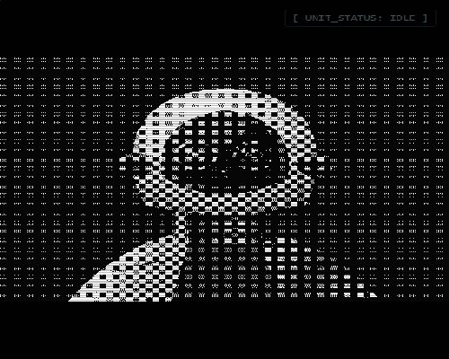

<div align="center">

<pre>
██╗   ██╗██╗   ██╗███████╗███████╗███╗   ██╗    ██╗  ██╗██╗███████╗
╚██╗ ██╔╝██║   ██║██╔════╝██╔════╝████╗  ██║    ╚██╗██╔╝██║██╔════╝
 ╚████╔╝ ██║   ██║███████╗█████╗  ██╔██╗ ██║     ╚███╔╝ ██║█████╗  
  ╚██╔╝  ██║   ██║╚════██║██╔══╝  ██║╚██╗██║     ██╔██╗ ██║██╔══╝  
   ██║   ╚██████╔╝███████║███████╗██║ ╚████║    ██╔╝ ██╗██║███████╗
   ╚═╝    ╚═════╝ ╚══════╝╚══════╝╚═╝  ╚═══╝    ╚═╝  ╚═╝╚═╝╚══════╝

        FULL-STACK ROBOTICS ENGINEER // CMU AIE
</pre>

<br>

<a href="https://yusenthebot.github.io"></a>

<a href="https://yusenthebot.github.io">>>_ENTER__TERMINAL-000000?style=for-the-badge&logoColor=white" /></a>

<br>


</div>

---

<div align="center">

```
╔══════════════════════════════════════════════════════════════╗
║  $ cat /sys/info/about.md                                    ║
╚══════════════════════════════════════════════════════════════╝
```

</div>

```
  I build robots end-to-end — from low-level motor control
  to high-level AI reasoning.

  AI Engineering @ Carnegie Mellon University.

  Core maintainer of Vector OS Nano — a cross-embodiment robot
  operating system with autonomous navigation, natural language
  control, and sim-to-real transfer.

  I believe the future belongs to machines that can perceive,
  plan, and physically act in the real world.
  I'm here to build that future.
```

---

<div align="center">

```
╔══════════════════════════════════════════════════════════════╗
║  $ cat /org/vector-robotics/manifest.yml                     ║
╚══════════════════════════════════════════════════════════════╝
```

<br>

<a href="https://github.com/VectorRobotics"></a>

<h3>Co-founder & Builder</h3>

<a href="https://github.com/VectorRobotics/vector-os-nano"></a>


</div>

**Cross-embodiment robot operating system** with industrial-grade autonomous navigation,
natural language control, and sim-to-real transfer.

Hardware: **Unitree Go2 + SO-ARM101** | CMU Robotics Institute

<div align="center">

| | |
|---|---|
| **vector-robotics-core** | General-purpose agentic robotics system (Ubuntu + ROS2) |
| **openclaw-dashboard** | Terminal-aesthetic real-time agent monitoring panel |
| **G1-locomotion** | End-to-end humanoid locomotion & manipulation |

</div>

---

<div align="center">

```
╔══════════════════════════════════════════════════════════════╗
║  $ ls -la /sys/skills/                                       ║
╚══════════════════════════════════════════════════════════════╝
```

</div>

```
drwxr-xr-x  PERCEPTION    Computer Vision, LiDAR, Sensor Fusion, SLAM
drwxr-xr-x  PLANNING      Motion Planning, Task Scheduling, Behavior Trees
drwxr-xr-x  CONTROL       Real-time C++ Controllers, ROS2 Lifecycle Nodes
drwxr-xr-x  HARDWARE      FPGA, ESP32, AI+Hardware Co-design, Embedded
drwxr-xr-x  SOFTWARE      React, Node.js, Docker, CI/CD, Full-Stack Web
drwxr-xr-x  SIMULATION    Isaac Sim, MuJoCo, Gazebo, Sim-to-Real Transfer
```

<div align="center">
<p>
  
  
  
  
  
  
  
  
  
  
  
</p>
</div>

---

<div align="center">

```
╔══════════════════════════════════════════════════════════════╗
║  $ tail -f /var/log/current_focus.log                        ║
╚══════════════════════════════════════════════════════════════╝
```

</div>

```
  [2025-04-03 ACTIVE]  Vector OS Nano — cross-embodiment autonomy stack
  [2025-03-xx ACTIVE]  Embodied AI — end-to-end locomotion & manipulation
  [2025-02-xx ACTIVE]  Humanoid Robotics — autonomous reward via MJX
  [2025-01-xx DONE  ]  OpenClaw Dashboard — terminal-aesthetic agent monitor
```

---

<div align="center">

```
╔══════════════════════════════════════════════════════════════╗
║  $ ping yusen-xie --establish-link                           ║
╚══════════════════════════════════════════════════════════════╝
```

<br>

<a href="https://yusenthebot.github.io"></a>
<a href="https://github.com/VectorRobotics"></a>
<a href="https://www.linkedin.com/in/yusen-xie-5327b8382/"></a>
<a href="mailto:yusenthebot@outlook.com"></a>

<br><br>

```
┌───────────────────────────────────────────────────────────┐
│  [ STATUS: ONLINE ]  //  "One actuator at a time."        │
└───────────────────────────────────────────────────────────┘
```

</div>
